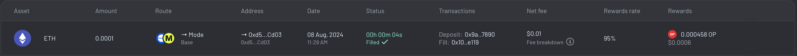

# Chain Abstraction

Project Name: **Siera** - An explorer for the Superchain with ERC3770 Chain-specific Addresses Search and support for ERC7683 Chain Abstraction transfer.

- [ERC3770](https://eips.ethereum.org/EIPS/eip-3770)
- [ERC7683](https://eips.ethereum.org/EIPS/eip-7683)

- Live Demo
  - https://siera.cc

## Getting Started

First, install dependencies

```sh
bun install
```

## Run Test

```sh
bun test
```

## Smart Account Address

Let's run this code with npm.

```sh
bun run smartAccountAddress
```

You should see the smart account address printed to the console.

```sh
Smart account address: https://{chain}.blockscout.com/address/{address}
```

If the request times out but the `pimlico.js` file has already been compiled to `pimlico.js`

```sh
node dist/pimlico.js
```

## Start Project

Run this to start a server at `http://localhost:3000`

```sh
bun run dev
```

Create deployment build

```sh
bun run build
```

## Features

- Our goal provide transfer routing between multiple L2 - L2 transfers with ERC7683 support that exclusively uses ERC3770 chain-specific address for searching address and creating transfers.
- We extend this concept by also deploying a L3 on top of Mode L2. This is a perfect use case for the need for readable ERC3770 address and using ERC7683 standards for token transfers.
- We provide a simple search tool and use demonstrated with MetalL2 search address.
- Using API from Across protocol we obtain many more tokens transfers routes between OPStack chains including those routing to L1.
- We support log in with passkeys.
- We also attempt use Farcaster for Log in - https://siera.cc/account
- This superhack attempts to also combine account abstraction and chain abstraction in addition to the ERC3770 and ERC7683 work.
- We also used Blockscout to verify contract of our L3 Gas Token on Mode Sepolia.
- The secret source for my search is AI and a transfer learning small model ~ 10mb in the browser that I can used with my voice and video frames to do search without a keyboard. (not implemented yet)

## ERC7683 Base L2 to Mode L2 Transfer

**Onchain transactions:**

- L2 Deposit: https://base.blockscout.com/tx/0x9a38d2ded120017328411dc9290d3c2f3886156b2c4190d0b5fd27672c407890

  - Amount: $0.257272
  - Gas: $0.00562

- L2 Fill: https://explorer.mode.network/tx/0x10c90594638e230b99c3c400402227e9a8c750ee617290c9e8fda61e649ee119



## Mode L2 to Custom Siera L3 Chain Transfer

**Onchain transactions:**

- Native Token - [https://sepolia.explorer.mode.network/address/0x76379783717d3aBA4da7A712C5996cB9Fe468F03?tab=contract](https://sepolia.explorer.mode.network/address/0x76379783717d3aBA4da7A712C5996cB9Fe468F03?tab=contract)

  - Deployed and contract verified with Blockscout
  - Deploy Setup: [https://github.com/mmsaki/chain-abstraction/commit/43ffaf63b551a39653f6691f53e13ad4f7999c59](https://github.com/mmsaki/chain-abstraction/commit/43ffaf63b551a39653f6691f53e13ad4f7999c59)
  - Foundry Script Runs: [https://github.com/mmsaki/chain-abstraction/commit/0cf6c4a8b1779717d393dfb122a0886203c99aed](https://github.com/mmsaki/chain-abstraction/commit/0cf6c4a8b1779717d393dfb122a0886203c99aed)

- L3 Explorer: [https://explorer-siera-17xzc7awfe.t.conduit.xyz/address/0x04655832bcb0a9a0bE8c5AB71E4D311464c97AF5](https://explorer-siera-17xzc7awfe.t.conduit.xyz/address/0x04655832bcb0a9a0bE8c5AB71E4D311464c97AF5)

  - Deployed with Conduit
  - We Deployed two L3 chains on Mode Sepolia with the same gas token
    - Chain one: **chainId**: 770, **Withdrawal Period**: 60 secs 1 minute
    - Chain two: **chainId**: 810, **Withdrawal Period**: 604,800 secs ~ 7 days

- BridgingToCustomL3: [https://explorer-siera-17xzc7awfe.t.conduit.xyz/tx/0x9793d9bc4144b30aa02b7492afd7864ecf57c7dcc005b2471549e13655e6448e](https://explorer-siera-17xzc7awfe.t.conduit.xyz/tx/0x9793d9bc4144b30aa02b7492afd7864ecf57c7dcc005b2471549e13655e6448e)

  - L3 fees paid in custom Gas Token token with 7 day confirmation period
